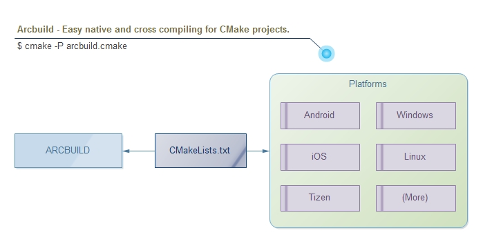

# ArcBuild

[](/../../actions?query=workflow%3Aandroid-arm)
[](/../../actions?query=workflow%3Aios-arm)
[](/../../actions?query=workflow%3Awindows-x64-vs2019)
[](/../../actions?query=workflow%3Alinux-x64-clang)

Easy native and cross compiling for CMake projects.




## Features

- Pure CMake scripts and no other dependencies.
- Support major platforms and system architectres, e.g. `windows`, `linux`, `android`, `ios`, `tizen`, etc.
- [BETA] Support to combine multiple modules into one library automatically.
  It's useful when building static library for SDK delivery ([check detail](docs/Advanced.md)).


## Dependencies

- [CMake](http://cmake.org/) >= 3.4 (3.8 or above is recommended)


## Usage

1. Download `arcbuild` and `arcbuild.cmake` to `<root of your project>/cmake`.
2. Build your project by runing `cmake -P cmake/arcbuild.cmake`.
3. More documents will be found in [docs](docs/README.md).

```
mkdir build
cd build
cmake -P arcbuild.cmake [(-D<var>=<value>)...] [<path-to-source>]
make
```


### Building Examples

#### Build for Android (`ARCH=armv7-a` by default)

```shell
cmake -DPLATFORM=android -DROOT="E:\NDK\android-ndk-r11b" -P arcbuild.cmake
# or read ROOT from ANDROID_NDK_ROOT enviroment variable
cmake -DPLATFORM=android -P arcbuild.cmake
```

#### Build for MSVC (`ARCH=x86` by default)

```shell
cmake -P arcbuild.cmake -DPLATFORM=vs2013
cmake -P arcbuild.cmake -DPLATFORM=vs2015
cmake -P arcbuild.cmake -DPLATFORM=vs2017
```

#### Build for Linux (`ARCH=x86` by default)

```shell
cmake -P arcbuild.cmake -DPLATFORM=linux
```

#### Build for iOS (`ARCH="armv7;armv7s;arm64;arm64e"` by default)

```shell
cmake -P arcbuild.cmake -DPLATFORM=ios -DIOS_BITCODE=ON
cmake -P arcbuild.cmake -DPLATFORM=ios -DARCH="i386;x86_64"
```

#### Custom cross compiling for Linux based platform

```shell
cmake -P arcbuild.cmake -DPLATFORM=linux -DARCH=arm -DTOOLCHAIN_FILE=gcc-toolchain.cmake -DROOT=~/xxx/prebuilt/toolschain/usr
```

For more arguments, please check [Arguments for Platforms](docs/PlatformArguments.md).


## Example Projects

- [hello_world](examples/hello_world): "Hello world" project.
- [combine_modules](examples/combine_modules): Simple SDK with multiple dependencies.


## TODO

- More tests.
- Set compile flags to individual source files.
